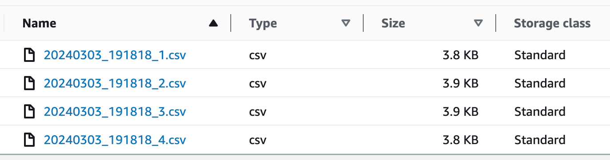
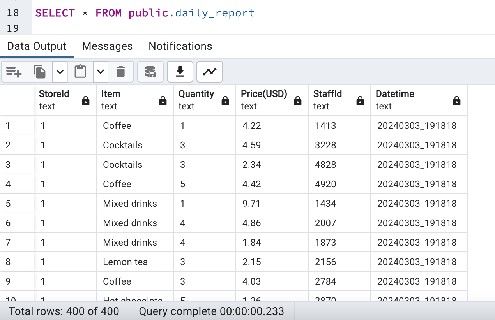

# cafebills

An ETL process demo with Dagster showing how to load data into postgresql from S3.

There are 2 options to use S3 from resource_defs or boto3. Follow the instruction in etl_aws_s3.py to customize.

S3 files:

Loaded data in data lake:

